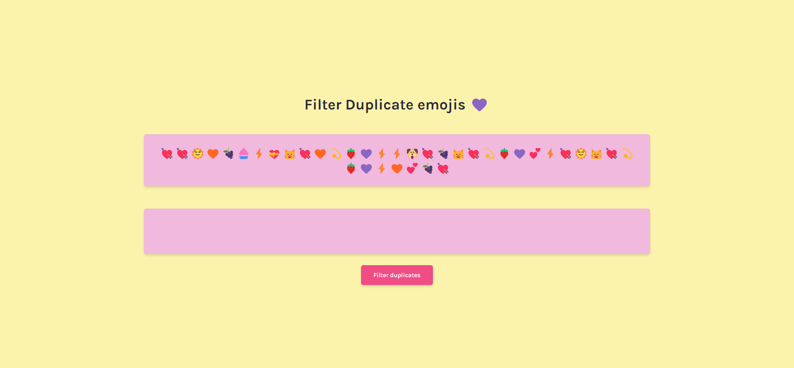
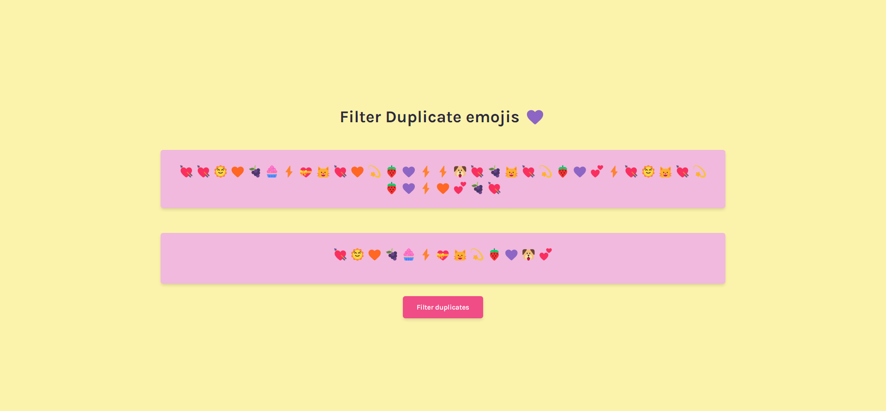
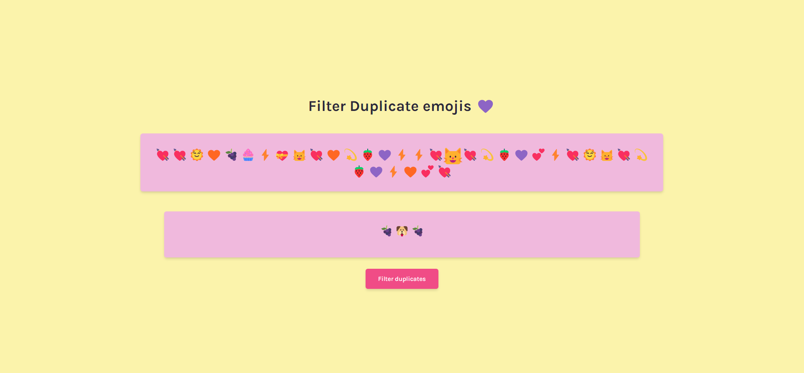
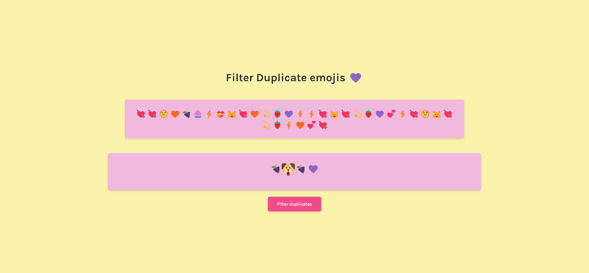

# Frontend Mentor - Profile card component solution

This is a solution to the [Valentine's Challenge](https://scrimba.com/learn/codeweeks/-romantic-grammar-corrector-challenge-co2514d1b9c9e8f6344b71d67). 

## Table of contents

- [Overview](#overview)
  - [Screenshot](#screenshot)
  - [Links](#links)
- [My process](#my-process)
  - [Built with](#built-with)
  - [What I learned](#what-i-learned)
  - [Continued development](#continued-development)
  - [Useful resources](#useful-resources)
- [Author](#author)
- [Acknowledgments](#acknowledgments)

## Overview

This is my solution to the Valentine's Challenge for the 16th of January, 2022.
It is a small project that interacts with the users to display a valentines
text and it will will fix the uppercases and the lowercases in an animated way.

### Screenshot






### Links

- Solution URL: [GitHub](https://github.com/newbpydev/valentines-16-2022)
- Live Site URL: [Live Site](https://relaxed-boyd-149753.netlify.app/)

## My process

### Built with

- Semantic HTML5 markup
- CSS custom properties
- Flexbox
- Javasript

### What I learned

I have learned on this project how to use the SetInterval and the clearInterval
functions to loop those a set of instructions by repeating after a certain
number of seconds.

```javascript
const animateLetter = () => {
  const letterEl = document.querySelectorAll(".letter");
  const letterFixedEl = document.querySelectorAll(".letter-fixed");
  let interId = 0;
  let index = 0;

  interId = setInterval(() => {
    if (letterEl[index].textContent !== letterFixedEl[index].textContent) {
      letterEl[index].classList.add("inactive");
      letterFixedEl[index].classList.add("active");
    }
    index++;

    if (index === letterEl.length) {
      clearInterval(interId);
    }
  }, 200);
};
```

### Continued development

For future development, I will continue to use expore the js Dom to manipulate
the elements on my pages.

### Useful resources

- [MDN - setInterval()](https://developer.mozilla.org/en-US/docs/Web/API/setInterval) - The setInterval() method, offered on the Window and Worker interfaces, repeatedly calls a function or executes a code snippet, with a fixed time delay between each call.
This method returns an interval ID which uniquely identifies the interval, so you can remove it later by calling clearInterval().

- [YouTube - Using the setInterval() function in JavaScript](https://www.youtube.com/watch?v=ubLC1JxMqfY&t=672s&ab_channel=dcode) - You can use the "setInterval()" function in JavaScript to make your code run repeatedly on a timer. This can be super useful for clocks, counters, updating your page with live data or even creating games.

## Author

- Website - [Juan Gomez](https://www.newbpydev.com)
- Frontend Mentor - [@newbpydev](https://www.frontendmentor.io/profile/newbpydev)
- Twitter - [@Newb_PyDev](https://twitter.com/Newb_PyDev)

## Acknowledgments

The code may not be perfect compared to my sensei @jonasschmedtman but I need
to thank him because he has shown me the ropes and now I am a confident web
designer.


